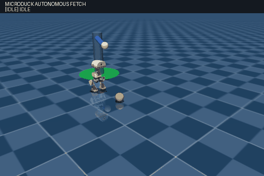
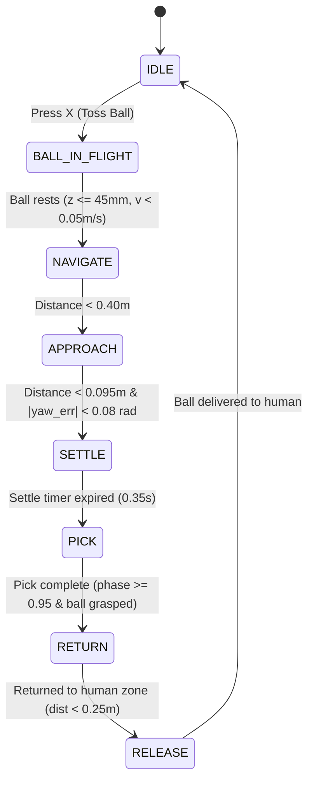

# Microduck: Autonomous Bipedal Fetch Robot

<div align="center">



*Autonomous Bipedal Fetch in MuJoCo: Ball toss, in-flight gaze tracking, omnidirectional pursuit, precision kinematic docking ($x^* = 85\text{ mm}$), beak grasping, upright recovery, and return delivery to human.*

[](LICENSE)
[](https://www.python.org/)
[](https://mujoco.org/)
[](https://github.com/Rhoban/bam)

</div>

---

## Overview

**Microduck** is a ~800 g, ~25 cm tall miniature bipedal robot powered by 14 Dynamixel XL330 smart servos with voltage-controlled BAM M6 actuator dynamics.

This repository features the **Autonomous Fetch System**: an autonomous behavior pipeline where the robot observes a ball launched into the arena, tracks its flight in real time with head gaze, navigates across the arena, docks at the millimeter-accurate kinematic sweet spot ($x^* = 85\text{ mm}$), grasps the ball with its beak, rises back to an upright stance, and delivers the ball back to the human zone.

The system replaces unstable monolithic reinforcement learning with a **Hierarchical Multi-Expert Architecture**, orchestrating an omnidirectional locomotion policy (`velocity.onnx`) and a specialized ground-pick manipulation policy (`ground_pick.onnx`) through a deterministic 8-state Finite State Machine (FSM).

---

## Quickstart

### Prerequisites
- Linux / WSL2
- Python 3.12+ and [uv](https://docs.astral.sh/uv/) package manager
- NVIDIA GPU with CUDA (for training) or CPU (for MuJoCo inference and rehearsal)

### 1. Clone Repository
```bash
git clone git@github.com:rootkind35-del/Microduck.git
cd Microduck
```

### 2. Run Interactive Autonomous Fetch in MuJoCo
Launch the simulation with realistic BAM M6 voltage-controlled actuators:

```bash
env -u PYTHONPATH uv run scripts/infer_policy.py \
  --scene src/mjlab_microduck/robot/microduck/scene_fetch.xml \
  --walking logs/rsl_rl/velocity/2026-09-27_23-17-48_velocity/2026-09-27_23-17-48_velocity.onnx \
  --ground-pick logs/rsl_rl/ground_pick/2026-09-30_02-43-42_ground_pick/2026-09-30_02-43-42_ground_pick.onnx \
  --new-cmd-obs
```

### Interactive Keyboard Controls
| Key | Action | Description |
|:---:|:---|:---|
| **`X`** | **Toss Ball** | Launches the ball from the human hand with physical impulse and parabolic arc |
| **`F`** | **Toggle Auto-Fetch** | Engages/disengages the autonomous 8-state FSM pipeline |
| **`G`** | **Manual Ground Pick** | Triggers the 4.0s periodic sinusoidal crouch & rise cycle |
| **`↑` / `↓`** | Forward / Backward | Overrides navigation manually ($v_x$) |
| **`←` / `→`** | Turn Left / Right | Overrides heading manually ($\omega_z$) |
| **`Space`** | Emergency Stop | Immediately zeroes all velocity commands |

---

## Recording Demo Video Directly with the Run Command

You can record the entire autonomous fetch sequence (or any simulation run) directly using the inference command with `--record-gif` or `--record-video`:

```bash
# Record demo GIF and MP4 headlessly using the exact inference command
env -u PYTHONPATH uv run --with imageio --with imageio-ffmpeg scripts/infer_policy.py \
  --scene src/mjlab_microduck/robot/microduck/scene_fetch.xml \
  --walking logs/rsl_rl/velocity/2026-09-27_23-17-48_velocity/2026-09-27_23-17-48_velocity.onnx \
  --ground-pick logs/rsl_rl/ground_pick/2026-09-30_02-43-42_ground_pick/2026-09-30_02-43-42_ground_pick.onnx \
  --new-cmd-obs \
  --auto-toss \
  --headless \
  --record-gif docs/microduck_fetch.gif \
  --record-video docs/microduck_fetch.mp4
```

---

## System Architecture



### Why Monolithic End-to-End RL Failed
Earlier attempts trained a single monolithic PPO policy (`microduck_fetch_env_cfg.py`) to simultaneously handle walking, ball tracking, and ground manipulation. This encountered fundamental physical and optimization dilemmas:

1. **Vertical Gradient Contradiction**:
   - Dynamic bipedal walking requires maintaining an upright trunk height ($z \approx 11.5\text{ cm}$) to ensure ground clearance during swing phases.
   - Grasping requires collapsing the trunk down to $z \approx 6.0\text{ cm}$ and dipping the beak to $z \approx 3.2\text{ cm}$.
   - Sharing all 14 servos under one policy created diametrically opposed reward gradients: penalizing trunk drops broke the crouch, while rewarding beak proximity destroyed walking balance.
2. **Exploration Dilemma & Reward Hacking**:
   - Under potential-based distance rewards (`ball_approach_potential`), the policy discovered that diving headfirst onto the ball maximized reward faster than slow, delicate steps. The robot repeatedly "face-planted" and triggered fall terminations.
3. **Sample Inefficiency**:
   - Training over 45M steps (>13 hours) failed to converge to a stable, reusable skill.

### The Hierarchical Multi-Expert Solution
The new architecture decouples navigation from manipulation by coordinating two specialized policies:

- **Locomotion Expert (`velocity.onnx`)**: Pre-trained over 3,750 iterations for stable, omnidirectional bipedal locomotion.
- **Manipulation Expert (`ground_pick.onnx`)**: Pre-trained over 3,500 iterations on a 4.0-second periodic sinusoidal clock ($\sin \phi, \cos \phi$) for contact-rich ground dipping and recovery.
- **Supervisor FSM (`scripts/infer_policy.py`)**: A deterministic state engine managing transitions, sensory gating, kinematics, and physical interaction.

---

## Key Technical Breakthroughs

### 1. Realistic Parabolic Ball Physics
The ball launches from the human hand site (`HUMAN_ZONE_POS = [-0.20, 0.23, 0.35]`) with realistic Newtonian physics ($v_x = 0.8 \dots 1.5\text{ m/s}$, upward loft $v_z = 0.8 \dots 1.3\text{ m/s}$), bounces against the MuJoCo floor, and rolls with rolling friction damping.

### 2. Strict In-Flight Freeze & Active Gaze Tracking
- **Stationary Invariant**: While the ball is in flight (`BALL_IN_FLIGHT`), the robot remains strictly stationary at its origin ($v_x = 0.0, v_y = 0.0, \omega_z = 0.0$).
- **Active Gaze Tracking**: The neck pitch and head yaw servos dynamically articulate to maintain eye-contact with the ball in 3D space.
- **Flight Gate**: Pursuit only starts when the ball settles on the floor ($z \le 45\text{ mm}$, speed $< 0.05\text{ m/s}$).

### 3. Turn-in-Place Heading Gating
To eliminate the classic "orbit bug" (where forward speed combined with heading error causes the robot to spiral endlessly around the ball), strict heading gating is enforced:
$$\text{If } |\text{yaw\_err}| > 0.30\text{ rad} \implies v_x = 0.0\text{ m/s}$$
$$\text{During final approach } (d < 0.40\text{ m}): \text{If } |\text{yaw\_err}| > 0.18\text{ rad} \implies v_x = 0.0\text{ m/s}$$
The robot pivots on the spot until oriented directly toward the ball, then advances in a straight, monotonic line.

### 4. Kinematic Sweet Spot Docking ($x^* = 85\text{ mm}$)
Precise geometric calibration between robot anatomy and ball dimensions:
- Microduck forward toe extension: $x_{\text{toe}} = +37\text{ mm}$ from trunk base.
- Ball radius: $R = 35\text{ mm}$.
- Clearance requirement: $\ge 72\text{ mm}$ to prevent accidental kicks.
- Lowest beak trajectory: At phase $\phi \approx 0.40 \dots 0.43$, the beak reaches $x_{\text{beak}} = +85\text{ mm}$ and $z_{\text{beak}} = 34.8\text{ mm}$ (resting directly on a 35 mm ball).
- **Docking Setpoint**: Docking precisely at $x^* = 85\text{ mm}, y^* = 0\text{ mm}$ guarantees **$13\text{ mm}$ toe clearance** while positioning the mouth directly above the ball.

### 5. Extended Recovery Phase ($\phi \ge 0.95$)
The ground-pick policy remains active until phase $\phi \ge 0.95$, guaranteeing that the robot is fully restored to a stable vertical standing stance before the walking policy resumes control.

### 6. Object Transport & Delivery
During the pick and return phases, the ball is latched $15\text{ mm}$ ahead of the beak in the yaw frame, carried across the arena to the human zone (`[-0.20, 0.23]`), and released with a forward impulse.

---

## Observation & Action Contracts

Policies operate under a unified **61D observation space** at 50 Hz:
- **Proprioception (48D)**: Base angular velocity (3), projected gravity (3), 14 servo positions (14), 14 servo velocities (14), previous actions (14).
- **Command Block (13D)**: `twist` ($v_x, v_y, \omega_z$, 3), `head_pose` (4), `body_pose` (6).
- **Action (14D)**: Target joint positions for 14 Dynamixel XL330 servos simulated via BAM M6 voltage-control physics.

---

## License

This project is licensed under the **Apache 2.0 License**. See [LICENSE](LICENSE) for details.
